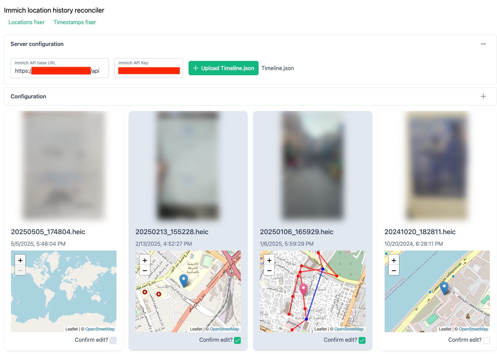
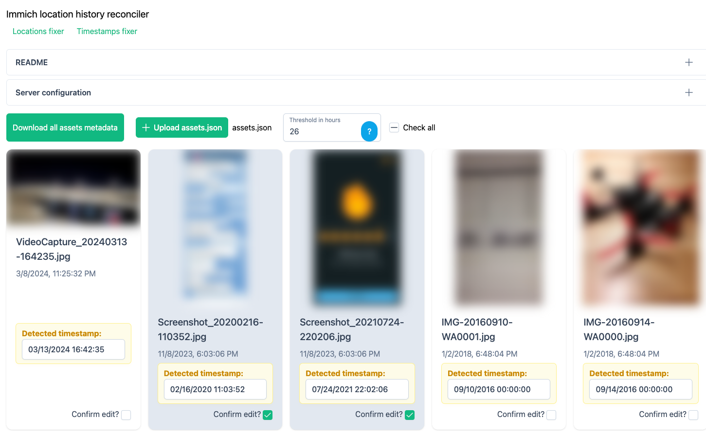

# Immich Location Fixer

This tool is designed to help you fix the location and timestamp of your photos in Immich.
It works by fetching images from your Immich server according to filters you set, and then uses your location history export from Google Maps to estimate the location of your photos using their timestamps.

All data is processed locally in your browser, and no data is sent to any server.

## Usage

Start by [generating an API key](https://immich.app/docs/features/command-line-interface/#obtain-the-api-key) for your Immich instance, then go to <https://aabounegm.github.io/immich-location-history-reconciler> and input the server details there.

> [!IMPORTANT]
> Your Immich server needs to be behind a reverse proxy that allows Cross-Origin Resource Sharing since this tool is hosted on a separate domain.
>
> The API key should have at least the following permissions (starting with Immich v1.135.0): `asset.update`, `asset.view`, and `tag.read`.

### Location fixer



On the main page, you can start by uploading your location history export from Google Maps.
Follow the instructions [here](https://support.google.com/maps/thread/264641290?hl=en&msgid=265088317) to download your location history.

> [!IMPORTANT]
> The timeline format from [Google Takeout](https://takeout.google.com/) is **NOT** supported and will be [discontinued by Google](https://blog.google/products/maps/updates-to-location-history-and-new-controls-coming-soon-to-maps/) soon. You need to download the location history from Google Maps app on your phone.

Then, you can filter the images you want to fix by tag and camera model (open an issue if you want to add more filters), and you will see a map under each image with the estimated location based on your location history.
It also shows the information from your location history that was used to estimate the location.

> [!NOTE]
> The estimation is indicated by a red marker. You can click anywhere on the map to set the location manually.
> Blue markers show visited places, blue lines show activities (walking, cycling, ...), and red paths show exact points you've been at a given time (this is the most accurate source).

### Timestamp fixer



Since the location fixer depends on the timestamp of your photos, it is important to make sure they are correct.
The timestamp fixer will show you the images with a timestamp in their filename that do not match with the file creation time.
This can sometimes happen if you copy/download the images from one source to another without preserving the file metadata.

Since this needs to run on all images in your library, it is necessary to first download the metadata of all assets to a JSON file, since detecting such a mismatch is not possible just by using the API.
To decrease the load on your server (instead of requesting all assets on every page load), you can download the metadata of all assets to a JSON file once and upload it here.

Additionally, I noticed an inconsistency between different cameras in storing the timestamp in the filename with regards to the timezone (some may store UTC timestamp, others store local timestamps, and they don't always store the timezone in the metadata). Therefore, it is advisable to use a threshold of more than 24 hours to avoid some false negatives.

## Running locally

Install dependencies:

```bash
pnpm install
```

Then start the development server on `http://localhost:3000`:

```bash
pnpm dev
```

## TODO

- Detect repeating dates in the timestamp fixer (there might be other images grouped under the same date without timestamp in the name)
- Show progress of downloading assets in timestamps fixer (or perhaps just add pagination there and request directly from API?)
- Host on some server to bypass CORS requirements
- Responsiveness/mobile-friendliness
- Use location of neighboring assets (from Immich or other estimations) in the location estimation (maybe if taken in less than 5 mins between both assets?)
- Add more filters to the location fixer (e.g. by date, semantic search, etc.)
- Dark mode
- [Location guessing using ChatGPT](https://danq.me/2025/04/17/chatgpt-beats-geoguessr/)?
